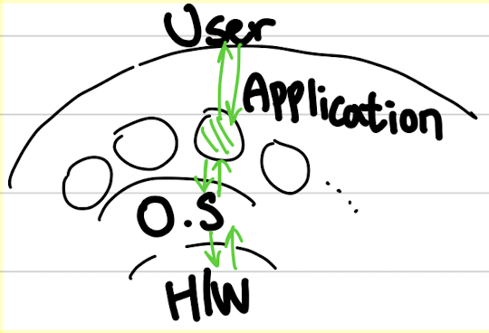

# 1️⃣ 차시

## 0. 강의 소개

### 📌 운영체제 목차
- 개요
- 컴퓨터시스템의 구조
- 프로세스 관리
- CPU 스케줄링
- 병행 제어
- 데드락
- 메모리 관리
- 가상 메모리
- 파일 시스템
- 입출력 시스템
- 디스크 관리


<br>

### 📌 운영체제 개요
💡 **`운영체제란?`**
        컴퓨터 하드웨어 바로 위에 설치되어 사용자 및 다른 모든 소프트웨어와 하드웨어를 연결하는 소프트웨어 계층으로서 모든 컴퓨터 시스템의 필수적인 부분
    👉🏻 운영체제가 없다면 컴퓨터 하드웨어는 단순한 고철덩어리에 불과함. 
    
    

하드웨어 위에 운영체제를 설치해두면)
<p align="center">
  
</p>

⇒ `하드웨어 + 운영체제` == `컴퓨터 시스템` 
⇒ 사용자는 하드웨어에 직접 접근하지 않으면서 운영체제와만 서로 인터페이스를 하며 쉽게 컴퓨터를 사용하게 됨. 운영체제를 제외한 다른 소프트웨어들도 하드웨어 직접접근보다는 운영체제의 관리를 받으면서 사용됨

<br>

### 📌 운영체제의 기능과 최종 목표

**💻 기능**

1. 하드웨어랑 어떻게 인터페이스를 해야하는가
2. 운영체제 위 사용자, 소프트웨어들과 어떻게 인터페이스를 하며 기능을 해야 하는가

**✨ 목표**

1. **컴퓨터 시스템을 편리하게 사용할 수 있는 환경을 제공한다.** 
    - 운영체제는 동시 사용자/프로그램들이 각각 독자적 컴퓨터에서 수행되는 것 같은 환상을 제공
    - 운영체제가 하드웨어 자원을 적절히 배분하고, 실행 순서를 잘 관리해주어 다른 프로그램들이 같이 돌아가고 있지만 내 프로그램만 돌아가고 있다는 환상을 제공시킴
    - 하드웨어를 직접 다루는 복잡한 부분을 운영체제가 관리

2. 컴퓨터 시스템의 **자원을 효율적으로 관리한다. `(== 자원 관리자)`**
    - 자원이란?) **프로세서, 기억장치, 입출력 장치** 등
    - 부가적으로) 자원을 형평성있게 잘 배분하는 것도 운영체제의 목표이자 역할이다. 특정 프로그램이 지나치게 자원을 독점하거나, 대우를 못받는 부분을 방지해야 함.


 ```sh
🧃 본인을 직접 운영체제라고 생각하면 편하다. 앞으로 내가 어떻게 하드웨어를 관리해야 편할까. 운영체제들을 관리해야 편할까를 생각하면 이해하기 쉬울 것이다. 
예를 들어 한 나라의 왕이 있다고 했을 때 그 나라를 잘 통치해야 (자원 관리, 세금 배분 등) 그 나라가 잘 운영되는 것처럼 
운영체제도 마찬가지로 컴퓨터를 통치하는 중요한 소프트웨어이기 때문에 운영체제가 컴퓨터 안에 있는 여러가지 하드웨어들을 어떻게 잘 관리하고 여러 프로그램들을 어떻게 잘 관리하느냐에 따라 컴퓨터가 잘 운영되게 된다. 
최근에는 운영체제가 데스크탑 PC의 범주를 벗어나서 모바일이나 자동차 소프트웨어까지 확장되어서 이 부분을 잘 관리하는 것도 중요한 문제로 대두되고 있다.
 ```


---

<br>

## 1. Introduction to Operating Systems

## 💡 운영체제란?
   |  
--- | --- | 

- 컴퓨터 하드웨어 바로 위에 설치되어 사용자 및 다른 모든 소프트웨어와 하드웨어를 연결하는 소프트웨어 계층
- 협의(**좁은 의미**)의 운영체제 : **`커널`**
    - 운영체제의 핵심 부분으로, 컴퓨터 전원을 켜고 부팅이 일어난 후 메모리에 상주하는 부분
- 광의(**넓은 의미**)의 운영체제
    - 커널 + 각종 주변 시스템 유틸리티를 포함한 개념
        - 윈도우즈 운영체제를 컴퓨터에 설치한다면 운영체제 커널만 있는 것이 아니라 각종 부가 프로그램들이 같이 설치됨. 파일 복사와 같은 프로그램은 별도의 소프트웨어이기 때문에 항상 메모리에 상주하는 커널에 포함되진 않음. 최소 필요한 유틸리티임. 이것을 포함한 것이 넓은 의미의 운영체제임.

<br>

## 💡 운영체제의 목적

운영체제는 H/W 위, 사용자나 각종 소프트웨어 아래에 위치하고 있다.
따라서! **`컴퓨터 시스템의 자원을 효율적으로 관리하는 것`** 이 주 목적이다.

<kbd>운영체제의 주 목적 2가지</kbd>
1. **컴퓨터 하드웨어를 효율적으로 관리하자**
    - 프로세서, 기억장치, 입출력 장치 등의 효율적 관리
        - 사용자간의 형평성있는 자원 분배
        - 한정된 하드웨어 자원으로 최대한의 성능을 내도록 → 하드웨어를 낭비하지 말고 성능을 향상시키자!
    - 사용자 및 운영체제 자신의 보호
    - 프로세스, 파일, 메시지 등을 관리

1. **컴퓨터 시스템을 사용하기 편리하게 만들자**
    - 운영체제는 동시 사용자/프로그램들이 각각 독자적 컴퓨터에서 수행되는 것 같은 환상을 제공
        - 예를 들어) 동시 실행중인 프로그램들에게 짧은 시간씩 빠른 자원인 CPU를 빠르게 번갈아 할당함으로써 동시 사용자/프로그램들로 하여금 자신의 프로그램만 점유하여 CPU를 사용하는 것처럼 환상을 느끼도록 함.
    - 하드웨어를 직접 다루는 복잡한 부분을 운영체제가 대행

<br>

## 🗂 운영체제의 분류

1. `동시 작업 가능 여부`
    1. 단일 작업 (single tasking)
        - 한 번에 하나의 작업만 처리
        - 예) MS-DOS 프롬프트 상에서는 한 명령의 수행을 끝내기 전에 다른 명령을 수행시킬 수 없음.
    2. 다중 작업 (multi tasking) → 현대의 운영체제
        
        
2. `지원해주는 사용자의 수 -> 동시에 접속하여 사용가능한지`
    1. 단일 사용자 (single user)
        - 예) MS-DOS, MS Windows
        - 단일 작업 환경에서는 단일 사용자를 지원
        
    2. 다중 사용자 (multi user)
        - 예) UNIX, NT server
        - 보안기능 추가
        - 사용자간의 자원을 형평성있게 분배해야 함

1. `처리 방식`
    1. 일괄 처리 (batch processing)
        
        → 현대 운영체제에서는 쉽게 찾아볼 수 없는 처리 방식 (역사 속의 시스템)
        
        - 작업 요청의 일정량을 모아서 한꺼번에 처리
        - 작업이 완전 종료될 때까지 기다려야 함
        - non-interactive 방식
        - 예) 초기 Punch Card
        
    2. 시분할 (time sharing)
        
        → 현대 운영체제의 처리 방식. 현재 우리가 사용하는 컴퓨터 그 자체가 시분할 시스템.
        
        - 여러 작업을 수행할 때 컴퓨터 처리 능력을 일정한 시간 단위로 분할하여 사용
        - 일괄 처리 시스템 (배치 프로세싱)에 비해 짧은 응답 시간을 가짐
            - 예) UNIX
        - interactive한 방식 : 어떠한 일을 처리했을 때 결과가 바로 화면에 나타나는 방식
        
        <br>
        
         ```sh
        🧃 시분할 시스템이 시간의 제약조건을 만족하지는 않음. 즉 시간의 데드라인이 정해져 있지 않음. 사용자가 많아질수록 시간이 더 길어지기 때문에 이럴 때는 아 사람이 많구나 하고 느끼게 됨.
        시분할 시스템은 사람이 느끼기에 빠르게 해주면서 동시에 주어진 자원을 최대한 활용하는 것이 목적이기 때문에 정확한 시간을 지켜주는 시스템은 아님. 즉 여러 ‘**사용자**'에 특화된 시스템.
        ```
        
    3. 실시간 (Realtime OS)
        - 정해진 시간 안에 어떠한 일이 반드시 종료됨이 보장되어야 하는 실시간 시스템을 위한 OS
        - 예) 원자로/공장 제어, 미사일 제어, 반도체 장비, 로보트 제어
        - 시분할 vs 실시간
            - 시분할 : 일반 범용 소프트웨어에 사용
            - 실시간 : 특수한 목적을 가진 시스템에서 그 작업이 반드시 정해진 시간만에 처리되어야 하는 시스템(예: 원자로 가동, 미사일 발사 등)에 사용
        - 실시간 시스템의 개념 확장
            - Hard realtime system (경성 실시간 시스템)
                - 조금이라도 시간이 어긋나면 문제가 생기는 강경한 실시간 시스템.
            - Soft realtime system (연성 실시간 시스템)
                - 조금은 시간이 어긋나도 되는 유연한 실시간 시스템.
                    - 예) 영화 감상 플레이 시스템
        
        <br>
        
        ```sh
        🧃 운영체제는 실시간 시스템을 사용하지는 않는다. time sharing을 주로 사용한다. 현대 운영체제가 영화를 감상하기 위해서 데드라인을 반드시 지켜주도록 운영체제가 작동하는가? -> 그렇지 않다. 
        시대에 맞춰 영화감상을 하는 애플리케이션을 지원하긴 하지만, 컴퓨터에서 지원되는 운영체제는 시분할(time sharing)이기 때문에 프로그램을 엄청 많이 띄워놓게 되면 아마 영화가 끊길 것이다. 
        이말인즉슨 시분할 시스템은 데드라인(초당 24fps)을 지켜주지 못한다는 것이다.
        하지만 요즘 실시간성을 띄는 애플리케이션이 많이 나오고 있기에 범용 운영체제가 실시간성을 지키게 하기 위해 어떻게 해야하느냐에 대한 문제가 대두되고 있다.
         ```
    
    💡 **현대 운영체제 : `다중 작업 + 다중 사용자 + 시분할`**
    
<br>

## 🗂 용어 정리

💡 **CPU가 하나뿐이더라도 동시에 공유하여 사용이 가능한 시스템**

`Multitasking`

- 여러 작업이 동시에 실행되는 것
- 태스크가 여러개 수행된다는 것은 엄밀히 말하면 CPU에서는 매 순간은 하나씩의 프로그램이 실행되는 것이지만 이 것이 아주 짧은 시간으로 분할해서 할당하여 사용되기에 동시에 수행된다고 생각되게 됨.
- 하나의 프로그램이 끝나기 전 다른 프로그램이 컴퓨터에서 실행이 가능한 환경

`Multiprogramming`

- 메모리에 여러 프로그램이 동시에 올라가는 방식
- 멀티태스킹과 유사한 용어이지만, **여러 프로그램이 메모리에 올라가 있음**을 강조

`Time sharing`

- 시간을 공유해서 사용
- 멀티태스킹과 유사한 용어이지만, **CPU의 시간을 분할하여 나누어 쓴다는 의미**를(프로세스를) 강조

`Multiprocess`

- 멀티태스킹과 유사한 용어
- 하나의 프로그램을 여러개의 프로세스로 구성하여 각 프로세스가 병렬적으로 작업을 수행하는 것

< = >

💡 **기본적으로 멀티태스킹이 지원이 되고 CPU가 여러개 있어야 하는 하드웨어적으로 다른 시스템**

`Multiprocessor` (=다중 처리기)

- 하나의 컴퓨터에 CPU (processor)가 여러 개 붙어 있음을 의미


<br>

## 🗂 운영체제의 예

`유닉스(UNIX)`

- 코드의 대부분을 C언어로 작성
- 높은 이식성
    - portable → 하나의 컴퓨터 기계어에만 국한되게 만든 그러한 운영체제는 다른 컴퓨터에 가져가면 기계어 자체가 다르기 때문에 운영체제를 다시 만들어주어야 한다. 하지만 유닉스는 대부분의 코드가 C언어로 작성되어 있고 C언어는 기계어와 독립적인 언어이기 때문에 다른 컴퓨터에서 컴파일만 하면 되기 때문에 이식성이 높다고 할 수 있음.
- 최소한의 커널 구조
    - 핵심적인 것만 커널에 배치하여 메모리 부담도 적고, 확장성도 높다.
- 복잡한 시스템에 맞게 확장 용이
- 소스코드 공개
- 프로그램 개발에 용이
- 다양한 버전

`DOS(Disk Operating System)`

- MS사에서 1981년 IBM-PC를 위해 개발
- 단일 사용자용 운영체제, 메모리 관리 능력의 한계(주 기억장치 : 640KB)

`MS Windows`

- MS사의 다중 작업용 GUI 기반 운영 체제
- 불안정성

`Handheld device를 위한 OS`


<br>

## 💻 운영 체제의 구조

<br>

   |  
--- | --- | 

`CPU` 

누구에게 CPU를 줄까? → **`CPU 스케줄링`**

- 일반적인 생각) 먼저 온 것을 선착순으로 처리하는 것이 효율적이다.
- **하지만!** 컴퓨터 시스템에서의 스케줄링에서는) 시간 차이를 만족해주면서 주어진 자원의 특성을 최대한 활용하는 방식을 사용하여 CPU 스케줄링을 함

 ```sh
🧃 은행에 가면 먼저 온 순서대로 번호표를 뽑아서 일을 처리하지만, 이러한 선착순 시스템을 운영체제에 그대로 도입시켜 하나의 시스템이 CPU를 점유하게 된다면 뒤에 줄서있는 시스템들은 긴 시간을 기다려야 하는 아주 비효율적인 문제가 발생한다. CPU는 굉장히 빠른데 하나의 프로그램이 그것을 독점해서 긴 시간동안 사용하고 놓지 않는다면 이런 빠른 자원을 효율적으로 활용할 수 없기 때문에 CPU 스케줄링은 짧은 시간 간격으로 자원을 줬다 뺏었다를 반복하여 자원을 효율적으로 활용할 수 있도록 스케줄링한다.
```

<br>

`메모리` 

한정된 메모리를 어떻게 쪼개어 쓰지? → **`메모리 관리`**

- 프로그램들이 많아지면 각각이 갖는 메모리 환경이 너무 작아짐 → 시스템이 원활하게 작동하지 않음
- 적어도 프로그램이 실행되기 위해 필요한 최소 메모리는 보장해주자. (워킹셋)
    - 나머지는 Disk로 쫓아내버리자.
    - 무조건 1/n 보다는 그때그때 알맞게 메모리를 보장해주자.
- 메모리는 크기가 한정되어있기 때문에 어떤 경우에 어떤 프로그램을 쫓아내야하는가? 가 메모리 관리의 주
    - CPU에서 머지않아 곧 사용될 프로그램은 쫓아내면 안되겠지?
    - → 미래 예측이 필요함. 데이터가 메모리에 올라온 이후로 사용량이 높은지 → 과거를 통한 예측이 주로 사용됨.

<br>

`디스크`

디스크에 파일을 어떻게 보관하지? → **`파일 관리`** (디스크 스케줄링)

- 어떻게 하면 헤드의 움직임을 적게 하면서 많은 요청을 빨리 처리할 수 있을까
    - 예) 택배 배달 → 이동 순서를 정해두고 움직임

<br>

`I/O Device`

컴퓨터가 상대적으로 느린 I/O Device와 어떻게 효율적으로 정보를 주고받게 하지? → **`입출력 관리`**

- **인터럽트**를 통해 인터랙션함.
- CPU는 빠른 장치이기 때문에 항상 본인의 할 일을 하고 있음. 그러다가 I/O 장치가 CPU에게 요청할 일이 있으면 그 때 인터럽트를 요청해서 CPU에게 알려주면, CPU가 다음 작업을 하기 전에 I/O 장치의 요청사항을 알아 처리하게 됨.

<br>

`프로세스관리`

- 프로세스의 생성과 삭제
- 자원 할당 및 반환
- 프로세스간 협력

<br>

`그 외`

- 보호 시스템
- 네트워킹
- 명령어해석기
 

 

