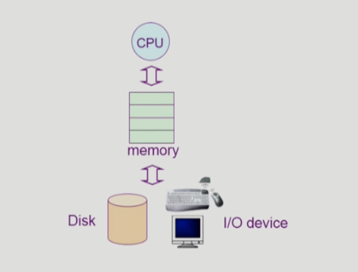

# 1강. Introduction to Operating Systems

## 1️⃣ 운영체제란 무엇인가?

### 운영체제 (Operating System, OS)


<p align="left">
  
</p>

운영체제는 하드웨어 바로 윗단에 설치되어 있는 소프트웨어

컴퓨터 하드웨어 - 사용자 및 다른 소프트웨어 사이에서 연결해주는 아이

***✨좁은 의미의 운영체제***

- 커널
- **운영체제의 핵심 부분을 커널**이라고 부름
- 항상 메모리에 상주하는 부분을 커널이라고 불러서 좁은 의미의 운영체제는 커널을 뜻함

***✨넓은 의미의 운영체제***

- 커널 + 주변 시스템 유틸리티를 포함한 개념
- **커널** + 파일복사하는 별도의 소프트웨어 등 **최소로 필요로 하는 유틸리티**가 포함된 개념이다.
    

<br>


## 2️⃣ 운영체제의 목적

1. 컴퓨터 시스템의 자원을 효율적으로 관리하는 것
- CPU, 메모리, 입출력 장치 = 시스템 안에 있는 하드웨어 자원 (리소스)
- 프로세스, 파일, 메시지 (소프트웨어 자원)
    
    ⇒  리소스를 효율적으로 관리하는 것이 가장 큰 목적
    
- 자원을 효율적으로 관리한다? 의 구체적인 의미
    - 효율성 ⇒ 주어진 리소스(하드웨어)를 가지고 최대한의 성능을 가지는 것
    - 형평성 ⇒ 형평성 있는 자원 분배
    
2. 컴퓨터 시스템을 편리하게 사용할 수 있는 환경을 제공하는 것
- 3명의 사용자가 하나의 컴퓨터에 프로그램을 동시에 실행시키는 것
    
    컴퓨터는 한 대이지만 사용자들 또는 프로그램들이 자신의 것만 컴퓨터에 돌아간다고 느끼게 해주는 것
    
    근데 사실은 컴퓨터가 내부적으로 관리를 잘해서 서로 다른 프로그램들을 잘 돌아가게 해주는 것
    
- How?
    
    운영체제가 효율적으로 자원을 관리하기 때문에 가능
    
    - CPU는 매우 빠른 자원인데 아주 짧은 시간 간격으로 각각의 프로그램에 할당하는 과정을 반복해서 사람이 느끼기에 자기 프로그램만 CPU를 점유해서 쓰는 것 같다고 함
    - 메모리도 각 프로그램들이 조금씩 각자 필요한 부분을 메모리에 올려놓고 실행하는데 이런 역할도 운영체제가 하는 것


<br>

## 3️⃣ 운영체제의 분류

1. ***동시 작업 가능 여부***
    1. `단일 작업`, 한 번에 하나의 작업만 처리
        
        ex. MS-DOS : 하나를 돌려놓으면 다른 프로그램을 입력할 수 없음
        
    2. `다중 작업`, 동시에 두 개 이상의 작업 처리
        
        현대적인 운영체제는 이에 해당
        
        ex. 유닉스, MS Windows 등 / 스마트티비 등 범용적인 작업 가능
        
2. ***사용자의 수***
    
    컴퓨터 한 대를 여러 사용자가 동시에 접속해서 사용할 수 있는지를 기준으로.
    
    1. `단일 사용자`
        
        ex. MS-DOS, MS Windows
        
        MS Windows → 이제는 여러 계정을 생성해서 접속할 수 있기는 함
        
    2. `다중 사용자`
        
        ex. UNIX, NT server
        

3. ***처리방식***
    1. `일괄처리 batch processing`
        
        작업을 모아서 한꺼번에 처리하는 것
        
        현대 운영체제에서 찾아보기 어려움
        
        ex. OMR 카드 처리기, 과거 동사무소 주민등록등본 떼기
        
    2. `시분할 time sharing`
        
        여러 작업이 수행할 때 시간 단위로 분할하여 사용
        
        짧은 응답시간
        
        **interacitive**한 방식 : 컴퓨터 두들겼는데 바로 결과가 나옴
        
        ex. 범용 컴퓨터
        
        []()
        
    3. `실시간 realtime OS`
        
        데드라인이 존재(정확한 시간 내)해서 그 시간 안에 반드시 결과가 나오는 것을 보장해줌
        
        특수한 목적을 가진 시스템에 사용
        
        ex. 미사일 제어, 반도체 장비, 로보트 제어 등
        
        ⇒ 실시간 시스템의 개념 확장
        
        1. `Hard realtime system`
            
            : 미사일이 이상한 곳으로 날라가서 터진다는 등 치명적인 영향
            
        2. `Soft realtime system`
            
            : 영화나 멀티미디어 프레임 등.. 해당 데드라인을 지키지 못하더라도 영화가 잠깐 끊길 뿐이지 치명적인 영향은 주지 않음
            
    

```
📖 
현재 컴퓨터나 스마트폰에서 사용되는 운영체제는 Time Sharing 위에서 돌아가고 다중작업, 다중 사용자에게 제공
됨

```

<br>

#### 헷갈리는 몇 가지 용어

**⚙️CPU가 1개라는 것을 가정하에**

1. ```Multitasking``` : 하나의 작업이 끝나기 전에 다른 작업이 컴퓨터에 돌아가는 것
2. ```Multiprogramming``` : 메모리에 여러 프로그램이 동시에 올라가는 것
    
    Multitasking이랑 다르게 **메모리 부분**을 좀 더 강조한 측면
    
3. ```Time Sharing``` : Multitasking과 유사하지만 **CPU를 강조한 측면**
4. ```Multiprocess``` : 하나의 프로그램을 여러개의 프로세서로 구성해서 각 프로세서가 병렬적으로 작업하는 것


**⚙️⚙️CPU가 여러개라는 것을 가정**

**하드웨어적으로 다른 시스템임**

5. ```Multiprocessor``` : CPU를 의미함 / 다중 처리기 / CPU가 여러개 있는 컴퓨터

<br>

## 4️⃣ 운영체제의 예

1. `유닉스 UNIX`
    
    초창기 : 대형 컴퓨터를 위한 것
    
    - 기계어(어셈블리언어)에 가까운 것으로 운영체제를 만들어서 코드가 복잡함
        
        → C언어 베이스 : 기계어와 가까운 언어
        
    - 초기에 소스코드를 공개했었음
        
        → 누구나 공부할 수 있어서 프로그램 개발에 용이
        
    - 높은 이식성 : 포터블하다
        
        → 전혀 다른 컴퓨터로 이식하기 쉬움
        
        → C언어를 공통적으로 사용해서 유닉스 운영체제라면 
        
    - 작은 커널의 구조 : 웬만한 기능은 밖으로 빼고 핵심적인 기능만 넣었음
    - ex. Linux, Solaris
    
2. `DOS, Disk Operating System`
    - 단일 프로그램만 지원하고 메모리 크기(640KB)도 작았음
    
3. `MS Windows`
    
    초창기 : 개인용
    
    - GUI 기반 운영 체제
    - 다중 작업용
    - 풍부한 지원 소프트웨어

<br>

## 5️⃣ 운영 체제의 구조

<p align="left">
  
</p>

1. `CPU 스케줄링`
    - 어떤 프로그램한테 CPU를 할당할까?
    - 기본적으로 먼저 들어온 프로그램한테 먼저 할당해주는 것은 아님
    
    ex. CPU를 짧게 사용할 프로그램한테 먼저 할당
    
2. `메모리 관리`
    - 한정된 메모리를 어떻게 분배해서 사용할까?
    - 공평하게 1/n 씩 할당하는 것은 좋지 않음
    - 그때그때 메모리에 올라오는 프로그램에 몰아주는 것
    - 어떤 걸 메모리에서 쫓아내야 하느냐? → CPU에서 곧바로 사용하지 않을 것을 예측 (과거를 통해서 미래를 예측)

3. `디스크 파일 관리`
    - 디스크에 파일을 어떻게 보관하지?
        
        조각조각? or 연속적으로?
        
    - 디스크도 스케줄링이 필요하다
        
        적게 움직이면서 효율적으로 많은 일을 처리하는 것
        

4. `입출력 관리 I/O device`
    - 상대적으로 느린 입출력 디바이스와 빠른 CPU 간에 정보를 어떻게 주고 받을 수 있지?

5. `프로세스 관리`
    - 자원 할당 및 반환
    - 프로세스 간 협력
    - 프로세스의 생성과 삭제
    

등...

---

인간의 신체가 뇌의 통제를 받음

컴퓨터 하드웨어는 운영체제의 통제를 받으며 그 운영체제는 사람이 프로그래밍하는 것

