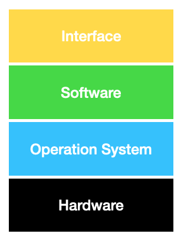

# OS 왜 배울까?

그전에 운영체제, OS가 무엇일까.

사용자는 소프트웨어를 주로 쓰는데, 소프트웨어가 결국에는 하드웨어를 기반으로 돌아간다
(CPU,MEMORY, DISK)

physical, logical을 연결해주는 것이 운영체제이다.

OS는 컴퓨터에서는 가장 critical한 중요한 소프트웨어이므로

컴퓨터에 가장 중요한 운영체제를 무시할 수 없다.

운영체제가 얼마나 효율적으로 운영이 되는지가 컴퓨터에 있는 모든 소프트웨어의 성능을 결정한다.

소프트웨어 엔지니어라면 OS가 제공하는 환경에 대해서 이해를 해야 한다.

> 환경 ⇒ 개발 환경

주어진 OS 하에서 **소프트웨어를 작성할 때 운영체제가 제공하는 기능을 활용해서** 어떻게 OS를 활용하면 가장 효과적인 최고의 성능을 발휘할 것인지를 이번 기회를 통해 생각해보는 기회를 가져보자!

OS는 하드웨어 Resource에 대한 abstraction을 한다.

> abstraction은 복잡한 것을 소프트웨어 측면에서 바라볼 때 조금 더 단순화 한 것을 말한다.
> 단순화하는 행위를 모델링이라고 하며,
> 단순화된 결과를 abstraction이라고 한다.

어떤 trade-off가 있는지 이해를 해야 한다.

타겟 플랫폼에 대한 정확한 이해,

> 우리의 경우 iOS에 대한

이해하고 있어야 운영체제가 제공하는 추상화나, trade-off, design 구현 방법에 대한 이해가 있어야 훌륭한 프로그램을 짤 수 있다.

OS가 abstraction을 제공하느냐에 따라서 개발자가 개발하는 접근하는 방식이 달라진다.

iOS에서는 카메라 작동에 대한 추상화를 아래의 문서와 같이 제공한다.

[Apple Developer Documentation](https://developer.apple.com/documentation/avfoundation/cameras_and_media_capture)

만약 iOS가 위와 같은 추상화를 제공하지 않았다면 카메라 디바이스에 대한 하드웨어의 구동 방법을 모두 이해하고 있어야 할 것이다.

따라서 Apple에서는 위와 같은 API로 카메라 작동에 대한 추상화를 제공하여 개발자의 편의와 생산성 향상을 도모한다.

따라서 OS가 제공하는 환경을 이해하기 위해서는 OS를 먼저 이해해야 하기 때문에 OS를 공부하게 되었다.

---

## OS란 무엇인가?

  

- OS는 Software - Hardware를 이어준다.
- 모든 Software는 OS 위에서 작동된다.
- OS는 abstractions(추상화)를 제공한다
  - 복잡한 걸 단순화시키는걸 abstraction이라고 한다.

하드웨어에 운영체제를 설치해놓으면 두개가 하나의 시스템이되고,

사용자는 컴퓨터를 직접 하드웨어에 접근하지 않으면서 OS하고만 인터페이스 하면서 쉽게 컴퓨터를 사용할 수 있다.

OS를 제외한 다른 소프트웨어도 하드웨어를 직접 접하기보다 다른 소프트웨어를 통해 관리를 받으면서 실행이 되도록 추상화를 제공한다.

- **좁은 의미의 운영체제 : 커널**
  운영체제의 핵심 부분을 커널이라고 부르고,
  커널은 컴퓨터 전원을 켠 다음 부팅이 일어난 이후로 항상 메모리에 상주하는 부분을 운영체제의 커널이라고 한다.
- **넓은 의미의 운영체제**
  커널을 포함한 주변 시스템을 다루는 유틸리티 프로그램을 포함한 것을 말한다.

# 운영체제 목표 두 가지

1. 컴퓨터 시스템 자원을 효율적으로 관리(자원관리자)
   자원(Resource) : CPU, 메모리, I/O장치
2. 컴퓨터 시스템을 편리하게 사용할 수 있는 환경을 제공한다.

### 1. 컴퓨터 시스템 자원을 효율적으로 관리(자원관리자)

리소스를 관리하는 데 있어서 필요한 요소 두 가지

- 효율성 : 주어진 자원으로 최대한의 성능을 내도록 하는 것
- 형평성 : 효율성만 강조하다 보면 특정 프로그램이나 특정 사용자가 차별받는 상황이 온다.
  특정 프로그램, 사용자, 너무 차별받아서 불이익 받지 않도록 어느 정도는 형평성 있는 자원분배를 이루도록 하는 것

**하드웨어 자원** : CPU, 메모리, I/O장치

**소프트웨어 자원** : 프로세스, 파일, 메시지

OS는 하드웨어 자원뿐 아니라, 컴퓨터 시스템 안에서 소프트웨어 자원도 관리를 해야 하는 책임을 가지고 있다.

### 2. 컴퓨터 시스템을 편리하게 사용할 수 있는 환경을 제공

위에서 살펴본 내용과 비슷하다.

사용자는 하드웨어 자원을 어떻게 분배해서 쓰는지 또는 하드웨어 자원 자체를 어떻게 관리하고 접근하는 것 이런 것에 대해서는 잘 알지 못하지만, OS가 있기 때문에 편리하게 컴퓨터를 사용할 수 있다.

## OS의 분류

- 동시 작업 가능 여부
- 사용자의 수
- 처리 방식

### 1. 동시 작업 가능 여부

동시작업이 가능한지 여부에 따라서 단일 작업만을 지원해주는 운영체제 다중작업을 동시에 실행할 수 있도록 지원해주는 운영체제로 나뉜다.

단일 작업(**single tasking**)

- 한번에 하나의 작업만 처리한다.

MS_DOS

- 키자마자 shell 스크립트가 실행이 된다.
- 프로세스의 생성 없이 바로 프로그램이 실행된다.

다중 작업(**multi tasking**)

- 동시에 두개 이상의 작업 처리

UNIX, Windows

### 2. 사용자의 수

컴퓨터 한 대를 여러 사용자가 동시에 접속해서 쓸 수 있는지를 기준으로 분류

- 단일 사용자 (**single user**)
- 다중 사용자 (**multi user**)

사용자가 많다면 각 사용자에 대한 파일, 메모리 접근에 대한 보안 기능도 추가되어야 한다.

### 3. 처리 방식

시분할(**time sharing**)

- 여러 작업을 수행할 때 컴퓨터 처리 능력을 일정한 시간 단위로 분할하여 사용
- 일괄 처리 시스템에 비해 짧은 응답시간을 가진다.
  예) UNIX
- interactive 한 방식이다.

실시간(**Realtime OS**)

- 정해진 시간 안에 어떠한 일이 반드시 종료됨이 보장되어야 하는 실시간 시스템을 위한 OS
- Hare realtime system
  데드라인을 정확히 지키지 않으면 치명적인 결과가 나오는 것을 제어하는 시스템
  예) 반도체 장비, 미사일 제어
- Soft realtime system
  데드라인은 있지만 조금 어겨져도 큰 문제가 생기지 않는 시스템
  예) 실시간 영화 재생, 멀티미디어 플레이

일괄 처리(**batch processing**)

작업을 모아 한꺼번에 처리하는 시스템

예) 초기 Punch Card 처리 시스템

## 몇 가지 용어

- Multitasking : 여러 작업이 동시에 실행되는 것을 말한다.
  엄밀히 말하면 CPU는 매 순간 하나에 한 작업만 짧은 시간으로 분할해서(시분할) 실행한다. 마치 동시에 실행되는 것처럼 보이는 작업을 말한다.
- Multiprogramming : 여러 프로그램이 메모리에 동시에 올라가는 것을 말한다.
  (메모리 측면을 강조)
- Time Sharing : CPU의 시간을 분할하여 나누어 쓴다는 의미를 강조한다.
- Multiprocess : 하나의 프로그램을 여러 개의 프로세스로 구성하여 각 프로세스가 병렬적으로 작업을 수행하는 것을 말한다.

## OS의 예

### UNIX

- 높은 이식성
- 최소한의 커널 구조
- **소스 코드 공개**
- 다양한 버전

> iOS는 기본적으로 UNIX 기반이지만 기조가 되는 것은 BSD UNIX이다.

### Windows

- MS 사의 다중 작업용 GUI 기반 운영체제

## OS에서 살펴볼 주요 이슈

1. CPU 스케쥴링
2. 메모리 관리
3. 프로세스 관리
4. 파일 관리
5. 입출력 관리

### 1. CPU 스케쥴링

- 누구한테 CPU를 줄 것인가에 대한 이슈

CPU와 메모리 간의 시간 차이를 완충하면서 주어진 자원의 특성을 최대한 활용하는 관리방식이 필요하다.

### 2. 메모리 관리

- 한정된 메모리를 어떻게 쪼개어 쓰는지에 대한 이슈

메모리에 너무 많은 프로그램을 동시에 올려놓는 것보다 CPU에서 원활하게 사용하기 위해서 필요한 메모리 용량이 있다.

### 3. 프로세스 관리

- 프로세스를 어떻게 관리하는지에 대한 이슈
- 프로세스의 생성과 삭제
- 자원 할당 및 반환
- 프로세스 간 협력

### 4. 파일 관리

- 저장장치에 파일을 어떻게 보관하는지에 대한 이슈

### 5. 입출력 관리

- 각기 다른 입출력 장치와 컴퓨터 간에 어떻게 정보를 주고 받게 하는지에 대한 이슈
