# Chapter 2 - System Structure & Program Execution

이번 챕터에서 살펴볼 것들 : 컴퓨터 시스템에서 하드웨어가 어떻게 동작하는지, 프로그램들이 하드웨어 위에서 어떻게 돌아가는지에 대해

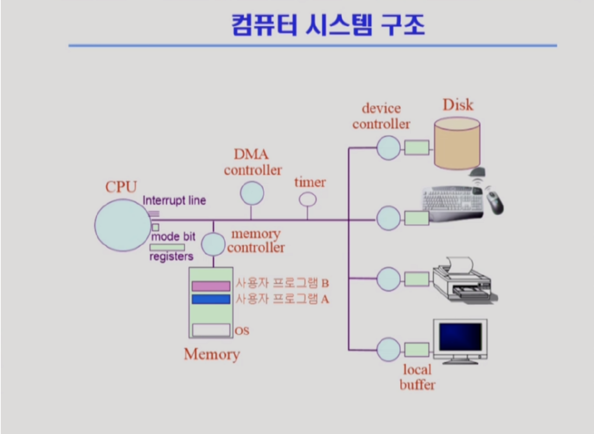

# 컴퓨터 시스템 구조

- 컴퓨터는 CPU와 메모리로 구성된 것을 말한다.
- 컴퓨터 시스템은 CPU와 메모리로 구성된 **컴퓨터**와 **I/O디바이스**들로 구성되어있다.
- CPU는 매 clock cycle마다 메모리에서 instruction 기계어를 하나씩 읽어서 실행을 한다.

### I/O device controller, local buffer

- device controller : 각각의 I/O device들은 device를 전담하는 작은 CPU를 가지고 있는데, 이를 device controller라고 한다.
- ex) 디스크에서 디스크 내부를 통제하는 것은 CPU의 역할이 아닌, 디스크에 붙어있는 disk controller가 해당 작업을 담당한다.
- local buffer : device controller의 작업 공간

## Interrupt line

키보드에서 어떤 입력이 들어오던지, 디스크에서 뭘 읽어와야한다던지, 디스크에 뭔가 읽어오라고 요청했을 때

요청한 작업이 완료되었다는 것을 CPU가 어떻게 알까?

⇒ 인터럽트 라인을 통해 알 수 있다.

- Interrupt line : CPU가 Instruction을 수행하면서 **Interrupt**
  가 있는지 확인하는 공간.

### 인터럽트 라인? 그전에 인터럽트란 무엇일까?

> [마이크로프로세서](https://ko.wikipedia.org/wiki/%EB%A7%88%EC%9D%B4%ED%81%AC%EB%A1%9C%ED%94%84%EB%A1%9C%EC%84%B8%EC%84%9C) 에서 **인터럽트**
> (interrupt)란 마이크로프로세서(CPU)가 프로그램을 실행하고 있을 때, 입출력 하드웨어 등의 장치에 예외상황이 발생하여 처리가 필요할 경우에 마이크로프로세서에게 알려 처리할 수 있도록 하는 것을 말한다.  
> [https://ko.wikipedia.org/wiki/인터럽트](https://ko.wikipedia.org/wiki/%EC%9D%B8%ED%84%B0%EB%9F%BD%ED%8A%B8)

인터럽트를 알아보기에 앞서 디스크에서 어떠한 것을 읽어오라는 요청과 같은 I/O **요청**은 어떻게 보낼까?

1. 프로그램 a가 disk에서 뭘 읽어와야한다면 직접 disk를 접근하는게 아닌,
   디스크 컨트롤러한테 특정데이터를 어딘가에서 읽어오라고 일을 시킨다.
2. 디스크는 요청데이터를 컨트롤러의 지시를 받아서 읽어온다.
   (읽어오는 작업은 굉장히 오래걸린다.)
3. 디스크는 시킨 일을 하면서 요청한 데이터를 읽어서 자신의 로컬버퍼에 집어넣는다.

- **CPU**는 굉장히 **빠른 장치**이다.
  2번 작업을 수행하는 동안 굉장히 빠른 CPU가 IDLE상태이면 낭비이다.

굉장히 빠른 CPU를 아무 작업도 시키지 않고 I/O작업이 끝날 때 까지 기다리게 하는 것이 아니라,

I/O작업의 처리 결과가 나왔을 때 까지 다른 작업을 시키고, I/O 작업이 끝나거나 처리해야할 작업이 생긴 경우 CPU에게 알려 해당 작업을 이어갈 수 있게한다.

> [마이크로프로세서](https://ko.wikipedia.org/wiki/%EB%A7%88%EC%9D%B4%ED%81%AC%EB%A1%9C%ED%94%84%EB%A1%9C%EC%84%B8%EC%84%9C) 에서 **인터럽트**
> (interrupt)란 마이크로프로세서(CPU)가 프로그램을 실행하고 있을 때, 입출력 하드웨어 등의 장치에 예외상황이 발생하여 처리가 필요할 경우에 마이크로프로세서에게 알려 처리할 수 있도록 하는 것을 말한다.  
> [https://ko.wikipedia.org/wiki/인터럽트](https://ko.wikipedia.org/wiki/%EC%9D%B8%ED%84%B0%EB%9F%BD%ED%8A%B8)

이러한 방식으로 사용을 하게 된다면, CPU와 I/O장치간의 속도차이에서 오는 비효율을 해소할 수 있을 것이다.

보통의 경우 프로그램이 메모리 접근만하면서 실행이 되다가 I/O작업을 하게 되면

해당 I/O 작업은 CPU 가 직접하는 것이 아니라,

I/O 컨트롤러 한테 시키고, CPU는 계속해서 다음 instruction을 실행한다.

- CPU는 Interrupt line을 통해 Interrupt를 확인한다.

## Timer

무한루프를 도는 프로그램이나, CPU를 한번 소유하면 I/O작업도 하지 않아, 계속 CPU를 점유하는 프로그램이 있다면 어떻게 할까?

이를 해결하기 위해 컴퓨터는 ‘타이머’라는 하드웨어를 두고 있다.

지난 시간 현대 운영체제는 시분할 시스템에 기반을 두고 있다고 했었다.

이러한 시분할 방식을 구현하는데 필요한 하드웨어가 바로 ‘**타이머**'이다.

시분할 시스템의 핵심은 '**타임슬라이스**'이다. 
'타임슬라이스'는 타이머 인터럽트를 통해 구현된다. 보통 10ms의 인터벌로 타이머 인터럽트를 설정해 구현된다.

> 타임 슬라이스 : 라운드로빈 스케줄링에서는 일정시간마다 프로세스가 강제로 교체되는데, 이 때 사용되는 일정시간이 바로 ‘타임 슬라이스'이다.

타이머라는 하드웨어를 두는 목적 : 특정 프로그램이 CPU를 독점하는 것을 막기 위해

### 타이머 실행 flowchart

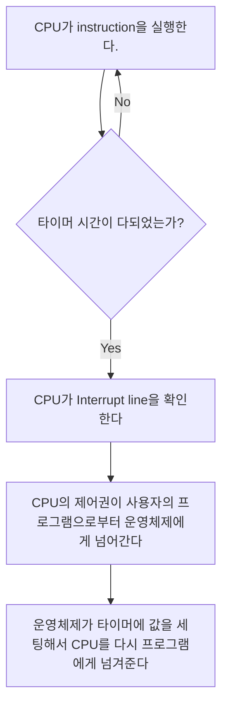

프로그램이 n개가 있다고 하면 cpu가 n개의 프로그램한테 하나씩 넘어갔다가 다시 앞에걸로 되돌아오고 이런식으로 cpu가 넘어가는 것이 운영체제가 관리를 하면서 타이머의 도움을 받아서 실행이 되고 있는 것이다.

종료가 되면 자동 cpu를 반납한다.

본인으 계속 cpu를 계속 쓰고 싶지만 여럿이 분할해서 써야하니 cpu의 시분할을 구현하기 위해 타이머를 두고 있다.

그렇다면 CPU가 운영체제가 가지고 있는지, 사용자 프로그램이 가지고 있는지 어떻게 알 수 있을까?

## Mode bit

`사용자 프로그램의 잘못된 수행으로 다른 프로그램 및 운영체제에 피해가 가지 않도록 하기 위한 보호 장치가 필요하기 때문에 Mode bit을 통해 하드웨어적으로 두 가지 모드의 operation을 지원한다.`

> 여기서 말하는 잘못된 수행이란, 사용자 프로그램이 다른 프로그램의 메모리 공간에 접근한다던지, 운영체제의 메모리 위치를 접근하는 시도, I/O 디바이스에 접근하려는 것을 말한다.

**Mode bit 구분**

0️⃣ Kernel Mode, Monitor mode :

커널 모드(0)의 경우 운영체제가 CPU를 소유하고 있기 때문에 어떠한 일이든 할 수 있게 정의되어있다. 메모리 접근 뿐 아니라, I/O 디바이스 접근도 실행할 수 있게 되어있다.

1️⃣ User mode :

유저 모드(1)의 경우 사용자 프로그램이 CPU를 소유하고 있기 때문에 제한된 instruction만 실행할 수 있다.

  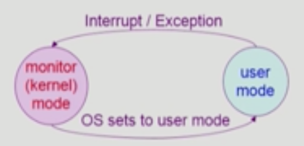

- 운영체제가 사용자 프로그램한테 CPU를 넘겨줄 때 mode bit을 유저모드(1)로 바꾸어 넘겨준다.
- 유저모드에서는 사용자 프로그램이 instruction을 실행하다가 I/O장치를 접근한다던지, 다른 프로그램의 메모리 공간, 운영체제 메모리 위치를 접근하는 시도를 하면 mode bit이 유저모드(1)것을 보고 instruction을 실행 못하게 하드웨어적인 구현을 해놓았다.

**인터럽트가 들어왔을 때는**

CPU제어권이 운영체제에게 넘어가면서 모드 bit은 커널모드(0)으로 바뀌게 된다.

위와 같이 Mode bit을 둠으로써 instruction set을 나누어 놓아
사용자 프로그램의 잘못된 수행으로 다른 프로그램 및 운영체제에 피해가 가지 않도록 보호한다.

### Direct Memory Access(DMA) 컨트롤러

  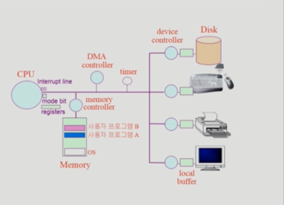

device controller는 I/O 작업이 끝났을 경우 Interrupt로 CPU에게 알린다.

> I/O 디바이스를 위한 컨트롤러에는 제어 정보를 위한 컨트롤러 레지스터, status register가 있고, 실제 데이터를 저장하는 로컬 버퍼를 가지고 있다.

- I/O device들은 자기 자신의 로컬 버퍼가 존재한다.
- 디스크나 키보드 등 I/O 장치에서 데이터를 읽어오는 경우, 우선 로컬 버퍼에 데이터가 임시로 저장한다.
- 로컬 버퍼의 데이터가 쌓이면 CPU가 로컬 버퍼의 데이터를 읽어서 자신의 작업영역인 메인 메모리에 복사한다.

### 위의 방식의 문제점은 뭘까?

- CPU에 인터럽트가 너무 많이 걸리게 된다.
  CPU가 인터럽트를 당하면 CPU는 OS로 소유권이 넘어가서 로컬 버퍼에 있는 내용을 메인 메모리에 복사한다.

인터럽트가 너무 많이 당하면 CPU와 같이 빠른 장치가 효율적으로 동작을 하지 못한다.

### **그럼 어떻게 해결할까?**

DMA 컨트롤러를 통해 해결한다.

**DMA 컨트롤러?**

### **Direct Memory Access Controller란**

말 그대로 직접 메모리에 접근할 수 있는 컨트롤러이다.

원래는 메모리를 접근할 수 있는 장치는 CPU뿐이었는데, DMA 컨트롤러를 두게 되면 메모리를 CPU도 접근, DMA도 접근할 수 있게 된다.

만약 CPU와 DMA가 특정 메모리 영역에 동시 접근하면 문제가 생길 수 있다.

> 원자성이 깨진다던지..

  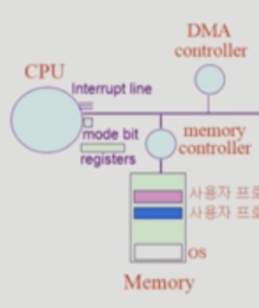

따라서 메모리 컨트롤러가 교통정리와 같이 중재하는 역할을 담당한다.

### **그렇다면 DMA는 어떠한 역할을 할까?**

I/O장치가 인터럽트를 자주 걸면 CPU가 I/O device 로컬 버퍼에 있는 내용을 메인 메모리로 카피하는 작업의 오버헤드가 너무 크다.

DMA가 로컬 버퍼에 있는 내용을 메인 메모리로 카피하고, 해당 작업이 끝났으면 CPU한테 인터럽트를 한번만 걸어서 그 내용이 메모리에 올라왔다는 것을 DMA가 CPU에게 보고한다.

⇒ CPU가 인터럽트를 당하는 빈도가 줄어들어 CPU와 같이 빠른 장치를 좀 더 효율적으로 쓸 수 있다.

### CPU의 메모리 접근

사실 CPU가 메모리에 직접 접근하지는 않고, 레지스터를 통해 접근한다.

  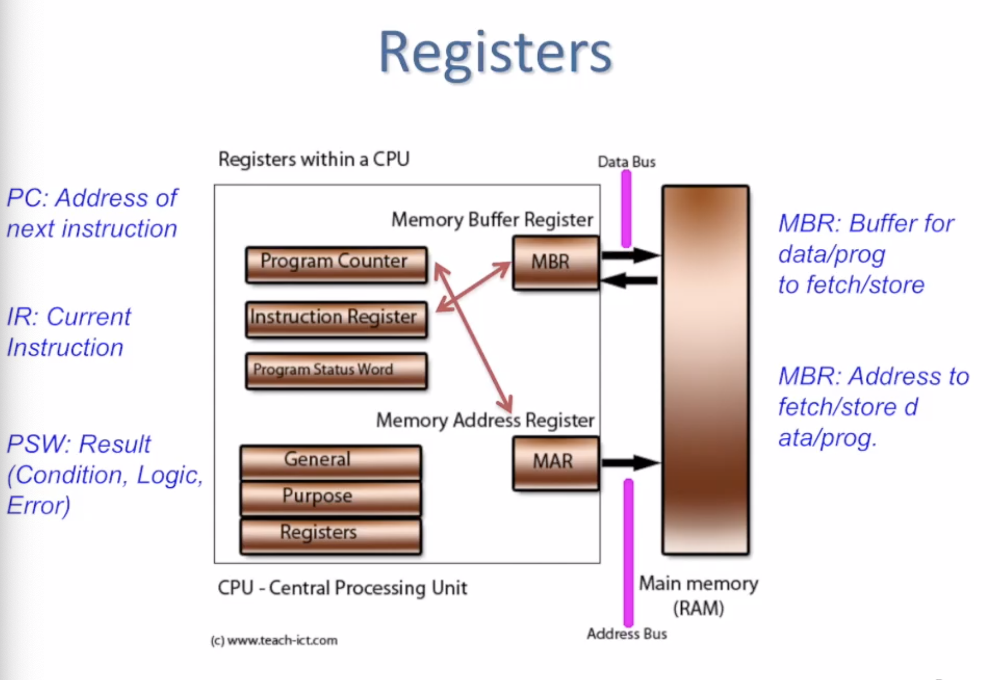

- 이미지 출처 www.teach-ict.com

cpu내부에는 레지스터라는 공간이 있고 레지스터들이 각기 다른 역할을 하는데,

특히 프로그램 카운터(PC)의 경우 다음번에 실행할 명령의 주소,
메모리 안에 있는 명령어의 주소를 가리키고 있고,

Instruction Register(IR)는 현재 수행해야 하는 명령어를 가지고 있다.

따라서 CPU가 직접 접근할 수 있는 공간은 레지스터이고,

CPU가 메인 메모리에 접근할 때는 CPU가 직접 접근하지 않고, 중간에 Memory Management Unit(MMU)를 통해 접근한다.

> [https://ko.wikipedia.org/wiki/메모리*관리*장치](https://ko.wikipedia.org/wiki/%EB%A9%94%EB%AA%A8%EB%A6%AC_%EA%B4%80%EB%A6%AC_%EC%9E%A5%EC%B9%98)

## 입출력(I/O)의 수행

사용자 프로그램은 어떻게 I/O를 수행할 수 있을까?

위에서 Mode bit을 살펴보았는데, I/O 디바이스에 접근하는 것은 커널모드에서만 가능하다고 했다.

사용자 프로그램은 유저모드에서 실행이 되는데, 그렇다면 I/O 작업을 어떻게 수행할까?

⇒ 시스템 콜을 통해 수행한다.

### 시스템 콜(System call)

사용자 프로그램이 운영체제의 커널 함수를 호출하는 것을 시스템 콜**(system call)**이라고 한다.

- 일반 함수호출과는 다르다.
  사용자 프로그램이 일반 함수를 호출 할 때는 해당 함수에 해당하는 instruction을 실행한다. 해당 함수에서 다른 함수를 호출하면 메모리 위치를 jump를 한다.

그렇다면 운영체제의 함수는 어떤 식으로 호출할까?

- 사용자 프로그램 안에서 함수를 호출하는 것은 메모리안에서, 메모리의 주소를 바꾸는 것인데, I/O 요청을 하기위해 운영체제의 함수를 호출하는 것은 메모리의 주소를 바꾸어서 되는 일은 아니다.

사용자 프로그램을 실행하다가 I/O를 해야한다면 직접 주소를 jump하지 못한다.

I/O를 하기 위해서는 운영체제의 해당하는 주소로 넘어가야한다.

- 유저모드에서는 불가능하다.

### 사용자 프로그램 I/O 요청과정

1. 사용자 프로그램이 직접 Interrupt line을 세팅하는 instruction을 실행한다.
2. CPU는 instruction을 실행하고 나서 Interrupt line을 확인한다.
3. Interrupt가 들어왔기 때문에 mode bit이 커널모드(0)으로 바뀐다.
4. CPU 제어권이 운영체제에게 넘어간다.
5. 운영체제가 I/O device에게 작업을 요청한다.
6. 요청한 작업이 끝나면 다시 Interrupt line이 세팅된다.

사용자 프로그램이 운영체제한테 대신 처리해달라고 요청을 해야하는 상황에서 Interrupt line을 세팅할 수 있는데, 이를 **소프트웨어 인터럽트(Trap)**이라고 한다.

- 인터럽트(하드웨어 인터럽트) : 하드웨어가 발생시킨 인터럽트
- Trap(소프트웨어 인터럽트)
- Exception : 프로그램이 오류를 범한 경우
  ex) divide by zero, 운영체제 메모리 접근 등등
- System call : 프로그램이 커널 함수를 호출하는 경우

따라서 사용자 프로그램이 I/O를 하기 위해서는 두가지 종류의 인터럽트가 걸린다.

사용자 프로그램이 I/O 작업을 요청할 때 : Trap ⇒ System call

사용자 프로그램이 요청한 I/O 작업이 완료되었을 때 : 하드웨어 인터럽트

  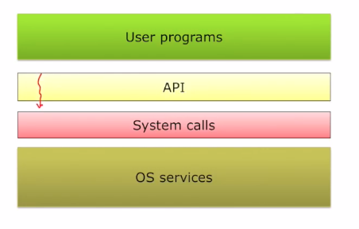

I/O 작업만 System call에 의해 되는 것은 아니고, 운영체제에게 무언가를 부탁할 때,

운영체제의 서비스를 받기 위해 System call을 통해 부탁한다.

System call이 운영체제 버전이 바뀔 때 마다 바뀌는 경우가 있기에,
운영체제가 개발자에게 추상화를 제공하기 위해 중간에 API라는 layer를 하나 더 두어 개발자들은 System call을 사용해야 하는 경우 더 쉽게 사용할 수 있다.

### 인터럽트 관련 용어

인터럽트의 종류가 되게 많고, 각각의 인터럽트 종류마다 운영체제가 해야할 일이 다르다.

ex) 타이머 인터럽트, I/O 인터럽트 등등

각각의 인터럽트 종류마다 무슨일을 해야하는지가 운영체제에 코드로 정의되어있다.

- 인터럽트 처리 루틴 : 인터럽트마다 처리해야할 실제 코드, 커널 함수
- 인터럽트 벡터 : 해당 인터럽트 처리 루틴의 주소를 가지고 있는 일종의 테이블 같은 곳

## 동기식 입출력과 비동기식 입출력

I/O는 커널을 통해서만 할 수 있다.

- Synchronous I/O : 사용자 프로그램이 I/O요청을 운영체제 커널에게 하면 → I/O장치에 맞는 디바이스 드라이버를 거치고 → 하드웨어를 통해 I/O를 읽거나 쓴다.(오래걸리는 작업)
  작업의 결과가 도착한 다음에 다음 작업을 하는 I/O 방식
- Asynchronous I/O : I/O작업만 운영체제 커널에 요청하고, CPU제어권을 다시 얻어 뭔가 다른 작업을 하는 I/O방식

### Synchronous I/O

  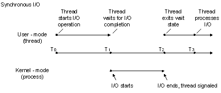

- 이미지 출처 : [마이크로소프트 공식문서](https://docs.microsoft.com/ko-kr/windows/win32/fileio/synchronous-and-asynchronous-i-o)

- 예를 들어 하나의 프로그램을 짰는데, 디스크에서 뭘 읽어와야한다고 하면,
  읽어온다음 보통 그 결과를 보고 그 다음 작업을 하도록 프로그램을 짠다.
  I/O작업을 하는동안 결과를 기다려야하기 때문에 Synchronous I/O만 할 수 있다.

하지만 I/O작업과 같이 오래걸리는 작업이 진행되는 동안 CPU가 아무일도 안하고 기다리고 있으면 CPU가 IDLE상태로 낭비된다.

따라서 Synchronous I/O를 구현할 때는 I/O가 완료될 때까지 해당 프로그램에게서 CPU의 소유권을 빼았고, 다른 프로그램에게 CPU 소유권을 넘겨주는 방식으로 구현한다.

### Asynchronous I/O

  

- 이미지 출처 : [마이크로소프트 공식문서](https://docs.microsoft.com/ko-kr/windows/win32/fileio/synchronous-and-asynchronous-i-o)

- Asynchronous I/O는 I/O가 시작된 후 I/O작업이 끝나기를 기다리지 않고 CPU제어권을 다시 얻어 계속해서 I/O와무관한 작업을 계속 진행하는 방식이다.

### 서로 다른 입출력 명령어

  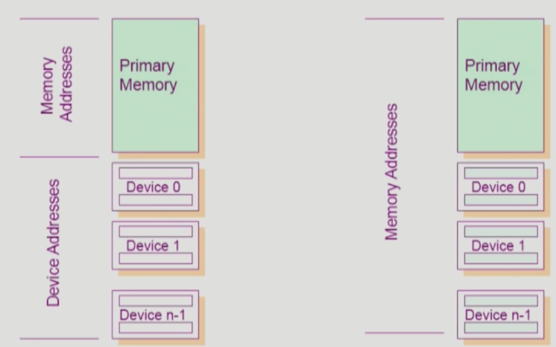

**CPU에서 실행할 수 있는 일반적인 I/O instruction(좌측 그림)**

- Memory Instruction Memory 따로, I/O를 수행하는 Special Instruction(load, store와 같은) 따로정의가 되어있다.
- I/O device도 주소가 있어서 특정 주소 I/O device에 접근 가능하다.

**Memory Mapped I/O : 메모리 주소에 연장 주소를 붙여 I/O 장치에 접근 하는 방식(우측 그림)**

## 저장장치 계층구조

  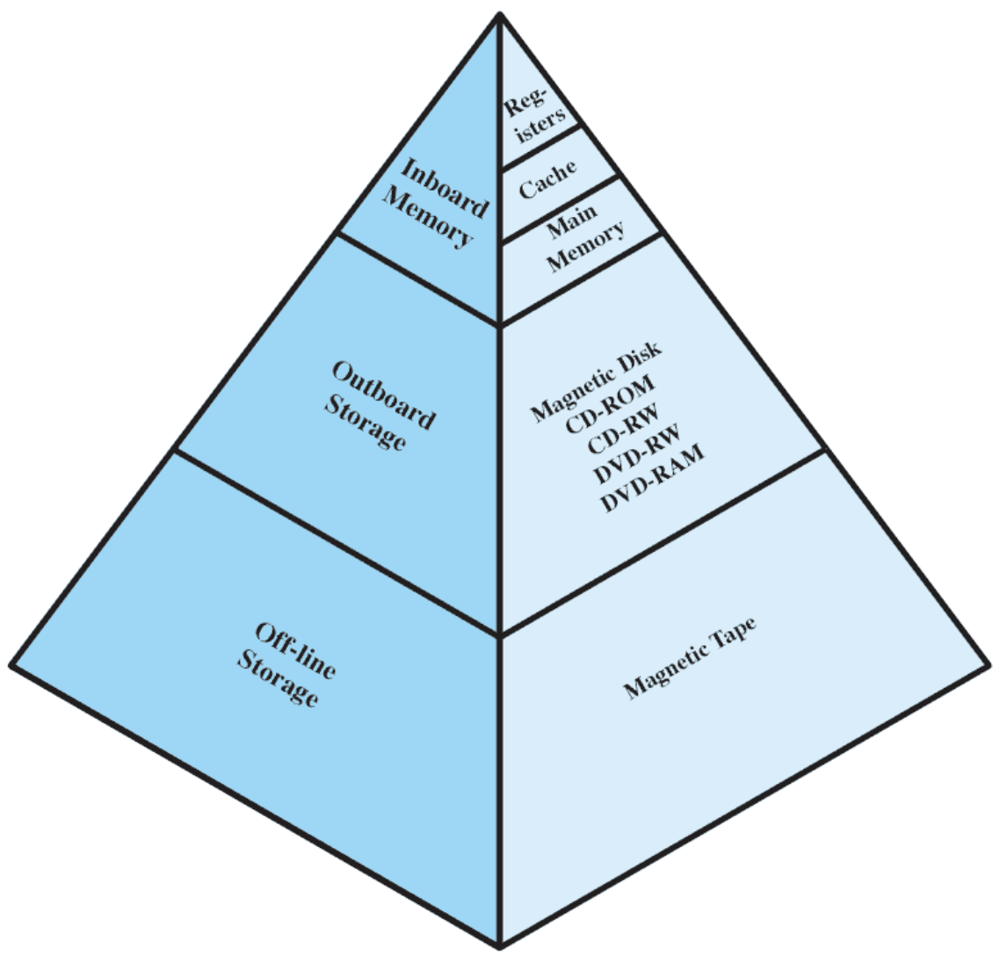

- Register → CPU
- Cache
- Main memory → Ram
- Magnetic Disk → HDD, SSD, Flash Memory

### 피라미드 아래로 갈수록

- 1 bit트당 드는 비용이 점점 감소한다.
  - 즉 아래로 갈수록 비트당 비용은 감소
- 용량은 증가한다.
  - 레지스터 보단 캐시 캐시보단 램 램보단 하드 디스크
- access time이 증가한다.(이는 속도와 반대 개념 즉 더 느려진다.)
- 접근의 빈도는 떨어진다. 즉 접근하는 빈도는 덜 해진다.

  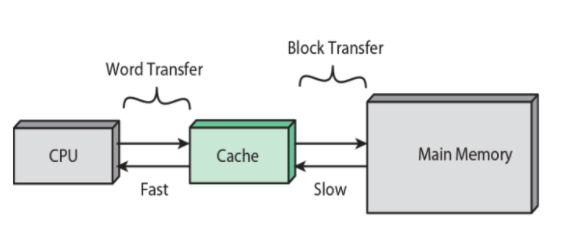

CPU와 메모리간의 속도차이를 완충하기 위해 캐시 메모리를 사용하며,

캐시 메모리는 메인메모리보다 용량이 작아 모든걸 담아두지는 못한다.

### Cache memory

- HW이다.
- CPU는 캐시 메모리에서 가져오는지 메인 메모리에서 가져오는지 알수가 없다.
- 메인 메모리의 일부만 복사해온다.
- 프로세스는 처음에 캐시 메모리를 확인한다.
  - 만약 캐시 메모리에 없다면 이제 메인 메모리에서 확인한다.
  - 이때 block 단위로 가져오는데 이걸 캐시 메모리에 가져와서 저장한다.
    block 단위로 가져오는 이유는 한번에 더 많이 가져와서 담고 있는게 더 효율적이기 때문이다.

## 프로그램의 실행(메모리 load)

  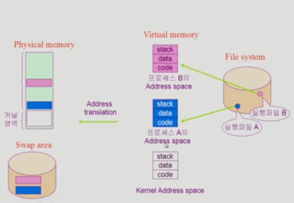

## 프로그램은 어떻게 실행되는가

프로그램은 실행파일 형태로 파일 시스템에 저장되어있다.

실행파일을 실행시키면 메모리에 올라와서 프로세스가 된다.

- 프로그램을 실행시키게 되면 주소공간이 형성된다.
  해당 프로그램만의 독자적인 주소공간
- 주소공간은 code, data, stack으로 구성된다.
  code : 기계어 코드를 담는 영역
  data : 변수, 전역변수, 자료구조를 담는 영역
  stack : 함수를 호출하거나, return 할 때 데이터를 쌓았다가 꺼내가는 용도로 사용하는 영역

이와 같은 독자적인 주소공간을 물리적인 공간에 올려서 실행시킨다.

커널은 컴퓨터를 켜서 부팅을 하면 메모리에 항상 상주해서 올라가있다.

- 프로그램을 실행시킬 때 만들어지는 주소공간을 메모리에 통째로 올려놓지 않는다.
- 당장 필요한 부분만 올려놓는다. → 메모리 낭비를 막기 위해
- 당장 필요하지 않은 부분은 디스크의 Swap area에 내려놓는다.

### Swap area

메인 메모리의 연장공간으로 하드디스크를 사용하는 것을 Swapping 용도로 사용한다고 한다.

이를 VM기법이라고 부르기도 하지만, VM은 각 프로그램마다 독자적으로 가지고 있는 주소공간을 VM이라고 하며, 둘의 용도가 다르다.

### 그렇다면 가상 메모리(Virtual Memory)란 뭘까?

- 실행중인 프로세스가 메모리가 아닌 가상의 공간을 참조해 마치 커다란 물리 메모리를 갖는 것처럼 사용할 수 있게 해주는 기법
- 가상 메모리와 물리적 메모리에서의 주소 번지가 다르다?
  → 주소 변환 계층에서 주소 변환 진행(MMU)

프로그램에 실제 메모리 주소가 아닌 가상 메모리 주소를 할당하는 방법

이와 연결해서 볼 수 있는 재미난 이슈가 있습니다.

## M1 Memory Swap Issue

  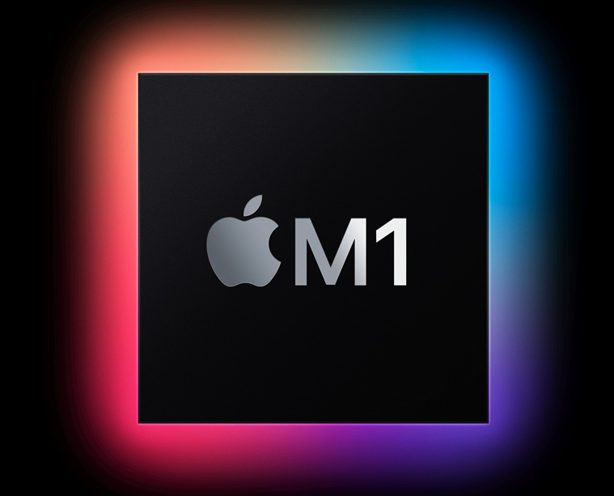

- 이미지 출처 Apple

M1 mac이 발표되고 나서 M1 memory Swap Issue가 있었는데요,

> [https://youtu.be/8pSC6QgxFzI?t=546](https://youtu.be/8pSC6QgxFzI?t=546),
> [https://www.macworld.com/article/338844/how-worried-should-you-be-about-your-m1-macs-ssd-lifespan.html](https://www.macworld.com/article/338844/how-worried-should-you-be-about-your-m1-macs-ssd-lifespan.html)

인텔 Mac보다 빠른 응답성과 속도를 보여준 M1칩의 빠른 속도의 이유는
CPU와 메모리가 M1칩에 같이 설계되어 있는 등, 여러가지가 있겠지만

메인 메모리의 연장공간으로 빠른 SSD를 Swapping 용도로 적극 사용하여 더 적은 메인 메모리 용량을 사용하면서도 빠른 속도를 낸다는 의견이 있었습니다.

물론 인텔 Mac에서도 Swap area를 사용하긴 했지만, M1 mac은 이를 성능을 위해 과도하게 메모리 Swap을 한다는 이슈가 있었습니다.

**이게 왜 문제가 될까요?**

하드디스크와, SSD는 읽고 쓰는 수명이 정해져있기 때문에 이 수명을 초과하게 된다면 더 이상 사용하지 못하게 되는 dead sector가 발생하게 됩니다.

하지만 걱정과는 달리 전혀 신경쓰지 않아도 될 수준이며, Mac OS 11.3베타에서 이러한 문제가 해결되었다라는 이야기가 나오기도 한다고 합니다.

> [https://youtu.be/8pSC6QgxFzI?t=609](https://youtu.be/8pSC6QgxFzI?t=609)

  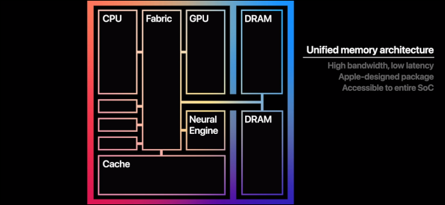

  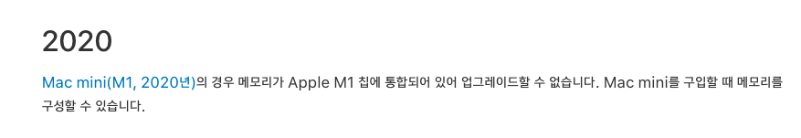

> M1 칩은 unified memory architecture를 가지고 있기 때문에,
> M1 칩은 메모리 업그레이드를 할 수 없습니다.

## 커널 주소 공간의 내용

  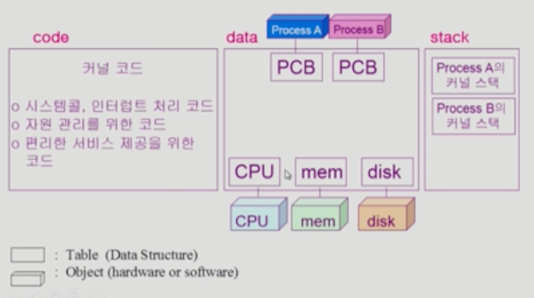

커널의 data 영역에는 운영체제가 사용하는 여러 자료구조들이 정의가 되어있다.

- Process Control Block(PCB)는 해당 프로그램을 관리하기 위한 자료구조이다.
- 운영체제도 함수구조로 코드가 짜여져있기 때문에 함수를 호출하거나 return 할 때 stack 영역을 사용해야한다. → 따라서 커널 스택이 있다.
- 사용자 프로그램마다 커널 스택을 따로 두고 있다.

## 사용자 프로그램이 사용하는 함수

### 사용자 정의 함수

- 자신의 프로그램에서 정의한 함수

### 라이브러리 함수

- 자신의 프로그램에서 정의하지 않고 갖다 쓴 함수
- 자신의 프로그램의 실행 파일에 포함되어 있다.

### 커널 함수

- 운영체제 프로그램의 함수
- 커널 함수의 호출 - 시스템 콜
